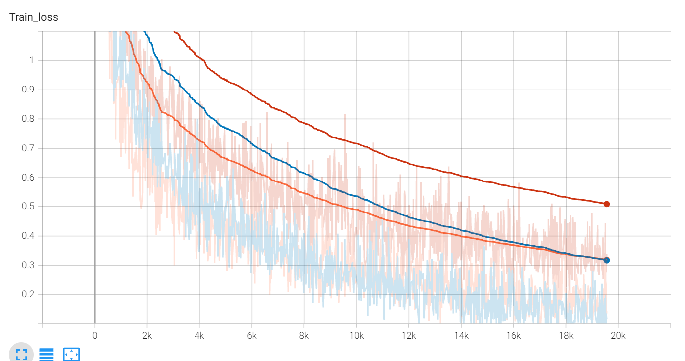

# 使用MobileNetV1训练cifar-10


## 启动
```
python train.py --data <data_path> --lr <learning_rate> --epoch <epoch>
```

使用MobileNetV1网络进行分类训练，采用Adam优化器，训练50Epoch。
##  调试学习率参数
lr = 0.1

lr = 0.01

lr = 0.001


lr=0.1为红色，lr=0.01为橙色，lr=0.001为蓝色


上面为不同学习率训练时的loss下降图，可以看出当学习率为0.01时loss下降最快并且下降为最低，并且经过测试，当学习率为0.01时训练出的模型精度最高，为88.8%。所以学习率这个超参选择为0.01较好。