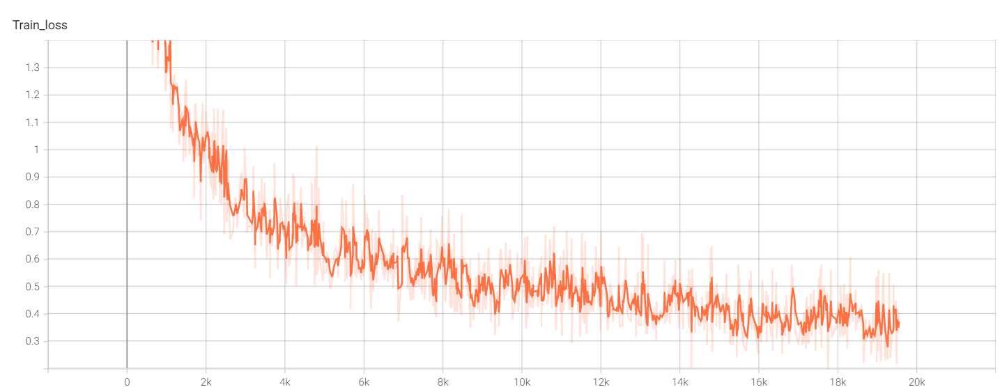
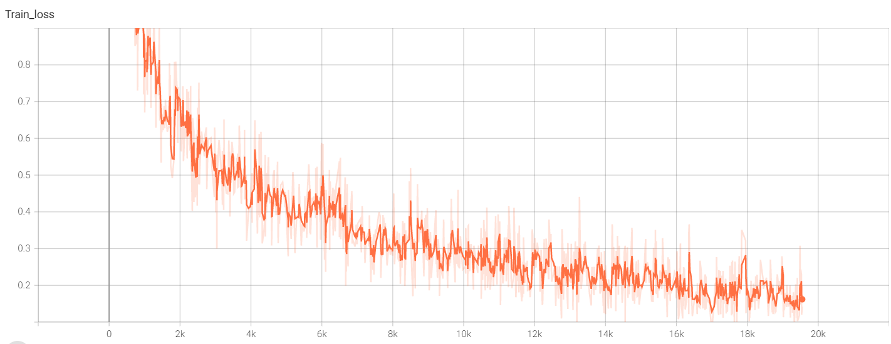
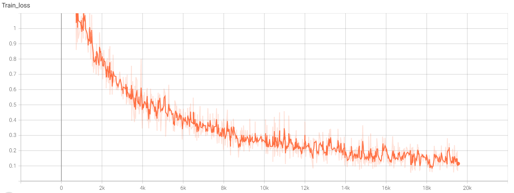

# 使用MobileNetV1训练cifar-10


## 启动
```
python train.py --data <data_path> --lr <learning_rate> --epoch <epoch>
```

使用MobileNetV1网络进行分类训练，采用Adam优化器，训练50Epoch。
##  调试学习率参数
lr = 0.1

lr = 0.01

lr = 0.001

